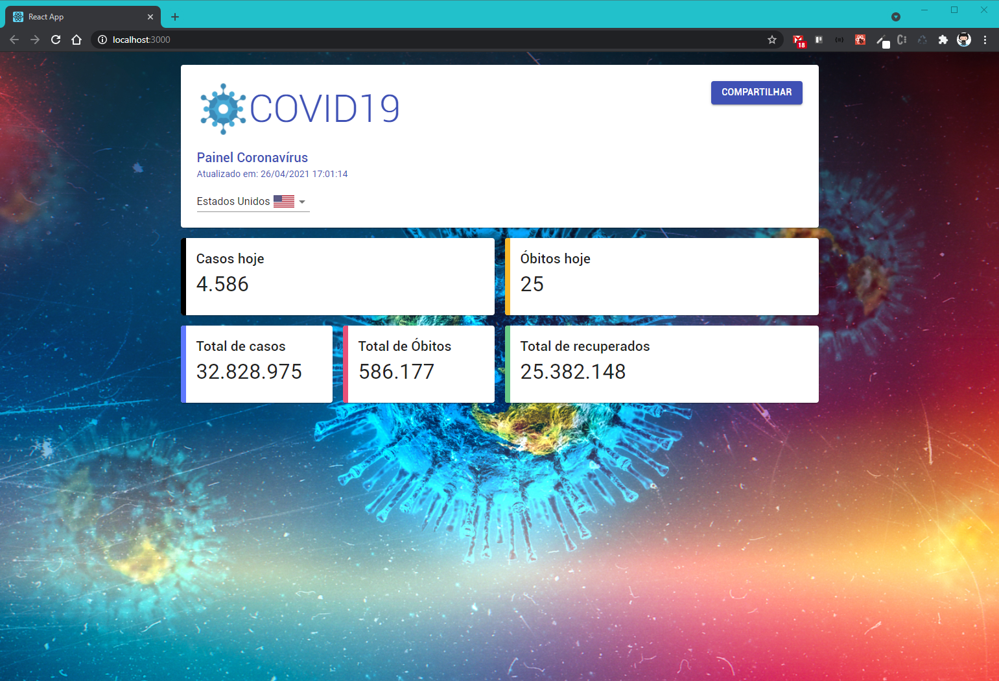
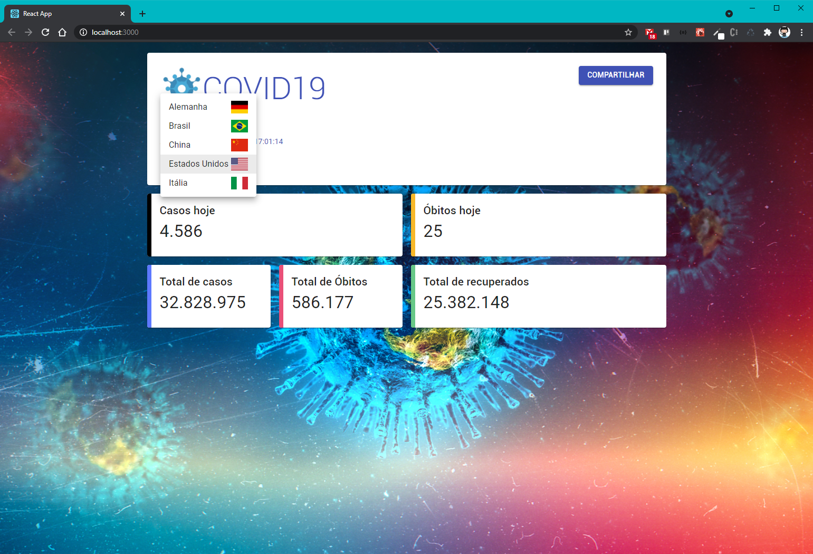
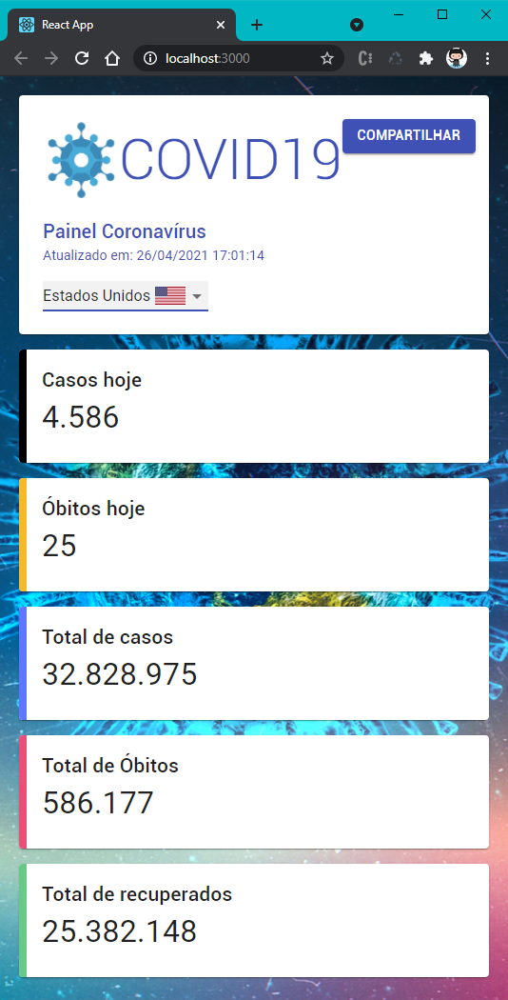

<div align="center">
   
</div>

<!-- Title -->
<h1 align="center">DIO - PWA Board COVID-19</h1>

<!-- Subtitle -->
<h2 align="center"> Projeto : COVID-19 </h2>

<!-- Badges -->
<p align="center">
  
  
  
</p>

<!-- Sobre o Projeto -->
<a id="sobre-o-projeto"></a>
## 🚀 Sobre o Projeto
Mantenha-se informado a respeito de todos os casos do COVID19 pelo mundo criando uma "Progressive Web Application (PWA)" utilizando React e aprenda como criar uma aplicação para ser executada no browser e funcionar como aplicativo contendo algumas funcionalidades de um aplicativo nativo. Tudo rápido e fácil, sem precisar subir para a Play Store ou App Store.

<a id="imagens-do-projeto"></a>
## 🖼️ Imagens do Projeto

<div align="center">
   
</div>

<div align="center">
   
</div>

<div align="center">
   
</div>


<div align="center">
   
</div>

<a id="tecnologias-e-bibliotecas"></a>
## 🧰 Tecnologias e Bibliotecas

* [ReactJS]()
  * [Styled Components]()
  * [Material UI Core]()
  * [Material UI Lab]()
  * [Customize CRA]()
  * [React App Rewired]()

<a id="links-úteis"></a>
### 🔗 Links Úteis
* [API](https://coronavirus-19-api.herokuapp.com/countries) - API Consumida no projeto 

<a id="rodando-o-projeto"></a>
## ⚙️ Rodando o Projeto

```bash
# Clone este repositório para a pasta anterior
$ git clone https://github.com/brunoemferreira/DIO-Covid19.git
# ou use a opção de download.

# Acesse a pasta dtmoney
$ cd covid19-dio

# Instale as dependências
$ yarn install
ou
$ npm install

# Rodar o Projeto
$ yarn start
ou
$ npm start

```
---